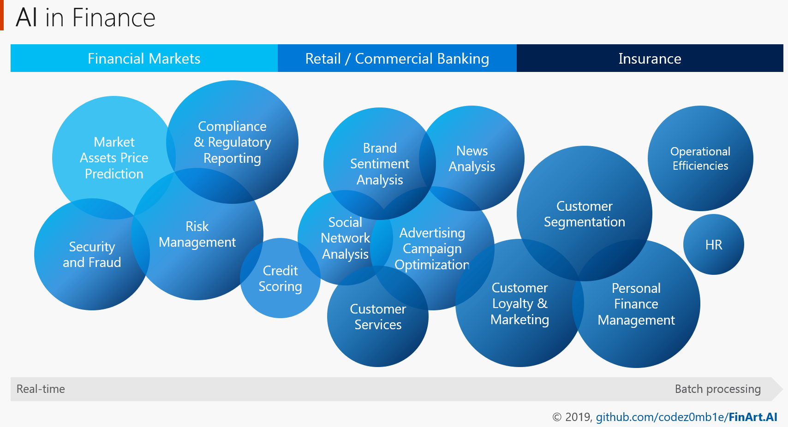

# AI in Finance

A curated list of insanely awesome  *financial data sets*, *research papers*, *use cases*, *libraries*, *frameworks* and resources for **AI in Finance**.

## ML for Financial Markets

List for Quantitative analysis and Trading.

- :star: **Datasets**
  - [Taxonomy](markets/taxonomy.md#datasets-taxonomy)
  - [Datasets](markets/datasets.md#datasets)
- [Service & APIs](markets/datasets.md#service-apis)
- :page_facing_up: [Research papers](markets/research-papers.md)
- :fire: [Frameworks](markets/frameworks.md)
- [Courses](markets/courses.md)

## Lists by other Sectors

| Sector | Datasets | Service & APIs | Use cases | Research papers | Community Activities (deprecated) |
| -- | -- | -- | -- | -- | -- |
| ML in __Retail Banking__ | [:white_check_mark:](banking/datasets.md) | [:white_check_mark:](banking/cases.md) | | | [Hackatons](hackathons.md), [Conferences](banking/conferences.md) |
|  ML cases in __Insurance__ | | | [:white_check_mark:](insurance/cases.md) | | |

## Hubs

- [Algorithms, Models, Research papers Hubs](hubs.md#algorithms-models-research-papers-hubs)
- [Data Hubs](hubs.md#data-hubs)
- [Data Privacy](data_privacy.md).
